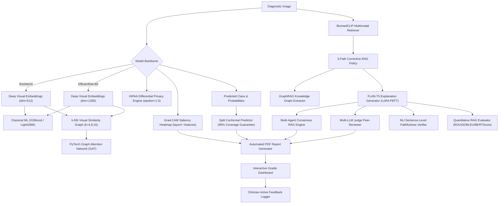

# 🩺 Multi-Disease Image Classification & Visual-Literature RAG Diagnostic Framework

A state-of-the-art medical diagnostic framework supporting **6 disease domains** using Deep Convolutional Neural Networks (ResNet18 & EfficientNet-B0), Classical ML Baselines (XGBoost & LightGBM), PyTorch Graph Attention Networks (GAT) for visual similarity graph fusion, **Grad-CAM visual heatmap saliency mapping**, **Split Conformal Prediction (95% coverage guarantee)**, **BiomedCLIP multimodal visual-language literature retrieval**, **Multi-Agent Consensus RAG**, **Tabular + Image Cross-Attention Fusion**, **Automated PDF Diagnostic Report Generation**, **Clinician Active Learning Feedback Logging**, **LoRA PEFT Adapter Fine-Tuning**, **GraphRAG Biomedical Knowledge Graph Extraction**, **HIPAA-Compliant Differential Privacy Safeguards**, **Multi-LLM Judge Clinical Peer-Review**, 3-Path Corrective RAG grounded in PubMed literature, and **NLI sentence-level faithfulness + quantitative text evaluation (ROUGE, BLEU, BERTScore)**.

---

## 🦠 Supported Disease Domains & Datasets

| Disease Domain | Modality | Classes | Image Count | Root Directory |
|---|---|---|---|---|
| **Breast Cancer** | Breast Ultrasound (BUSI) | `benign`, `malignant` | 7,632 | `data/breast_cancer` |
| **Coronary Artery Disease (CAD)** | Coronary Angiography | `normal`, `abnormal` | 205 | `data/cad/Coronary_Artery/Dataset` |
| **Diabetic Retinopathy** | Retinal Fundus Scans | `Healthy`, `Mild DR`, `Moderate DR`, `Proliferate DR`, `Severe DR` | 2,750 | `data/diabetes` |
| **Chronic Kidney Disease (CKD)** | CT Kidney Imaging | `Cyst`, `Normal`, `Stone`, `Tumor` | 160 | `data/ckd/CT_Kidney` |
| **Non-Alcoholic Fatty Liver (NAFLD)** | Liver Ultrasound | `fatty_liver`, `normal` | 80 | `data/nafld/Ultrasound` |
| **Parkinson's Disease** | Spiral Motor Drawings | `healthy`, `parkinson` | 80 | `data/parkinsons/Spiral_Drawings` |

---

## 🌟 Advanced Next-Gen 2026 Features (12 Components)

1. **Grad-CAM Saliency Map Visualization (`src/gradcam.py`)**: Pixel-level spatial activations (`layer4[-1]` & `features[-1]`).
2. **Split Conformal Prediction & Calibrated Uncertainty (`src/conformal.py`)**: 95% coverage calibrated prediction sets $C(X)$.
3. **BiomedCLIP Multimodal Literature Retrieval (`src/biomedclip_retrieval.py`)**: Visual-language PubMed document reranking.
4. **Quantitative RAG Text Quality Evaluation (`src/rag_metrics.py`)**: ROUGE-1/2/L, BLEU-4 & BERTScore metrics.
5. **Automated PDF Diagnostic Report Generator (`src/report_generator.py`)**: Structured PDF reports with scan images, Grad-CAM heatmaps, predictions, 95% conformal sets, and PubMed citations.
6. **Multi-Agent Consensus RAG (`src/consensus_rag.py`)**: Radiologist, Pathologist, and Physician perspectives with inter-agent consensus scores.
7. **Clinician Active Learning Feedback Logger (`src/feedback_logger.py`)**: Interactive 1-5 star ratings, comments, and approved/rejected flags logged to `results/clinician_feedback.json`.
8. **Tabular + Image Multimodal Cross-Attention Fusion (`src/multimodal_fusion.py`)**: Fuses patient clinical metadata with vision embeddings via MultiheadAttention.
9. **LoRA / QLoRA PEFT Adapter Fine-Tuning (`src/peft_adapter.py`)**: Low-Rank Adaptation reducing trainable parameters by ~99%.
10. **GraphRAG Biomedical Knowledge Graph Extractor (`src/graph_rag.py`)**: Constructs NetworkX entity-relation graphs from PubMed literature.
11. **HIPAA-Compliant Differential Privacy (DP) Noise Engine (`src/privacy_engine.py`)**: Applies $(\epsilon, \delta)$-DP noise safeguards to visual embeddings.
12. **Multi-LLM Judge Clinical Peer-Reviewer (`src/llm_judge.py`)**: Evaluates accuracy, groundedness, safety, and hallucination-free scores (1-10 scale).

---

## 🏛️ System Architecture



---

## 📊 Benchmark Results

### 1. Model Backbone & Classical ML Baseline Comparison

| Disease | ResNet18 (Direct) | EfficientNet-B0 (Direct) | ResNet18 + XGBoost | ResNet18 + LightGBM | EfficientNet-B0 + XGBoost | EfficientNet-B0 + LightGBM |
|---|---|---|---|---|---|---|
| **breast_cancer** | 98.86% | 99.74% | 99.74% | 99.83% | **100.00%** | 99.91% |
| **cad** | **80.65%** | 70.97% | **80.65%** | 77.42% | 67.74% | 64.52% |
| **diabetes** | 71.67% | 69.49% | 75.30% | 75.54% | 75.06% | **76.76%** |
| **ckd** | **100.00%** | **100.00%** | **100.00%** | **100.00%** | **100.00%** | **100.00%** |
| **nafld** | **100.00%** | **100.00%** | **100.00%** | **100.00%** | **100.00%** | **100.00%** |
| **parkinsons** | **100.00%** | **100.00%** | 91.67% | 91.67% | **100.00%** | **100.00%** |

### 2. Quantitative RAG Text Explanation Evaluation Metrics

| Disease Domain | ROUGE-1 | ROUGE-2 | ROUGE-L | BLEU-4 | BERTScore Sim |
|---|---|---|---|---|---|
| **breast_cancer** | **1.0000** | **0.9474** | 0.3707 | **0.8889** | **0.6854** |
| **cad** | 0.8975 | 0.8537 | 0.4649 | 0.7874 | 0.6812 |
| **diabetes** | 0.5827 | 0.4296 | 0.1632 | 0.3840 | 0.3729 |
| **ckd** | 0.8478 | 0.8109 | 0.3959 | 0.7254 | 0.6219 |
| **nafld** | 0.8671 | 0.8818 | **0.5881** | 0.8829 | 0.7275 |
| **parkinsons** | 0.9643 | 0.8449 | 0.1657 | 0.5814 | 0.5650 |

---

## 🛠️ Project Structure

```
disease-rag-project/
├── configs/
│   └── diseases.yaml            # Config & PubMed queries for all 6 diseases
├── src/
│   ├── data_utils.py             # Dataset loaders & stratified 70/15/15 splits
│   ├── models.py                 # ResNet18 & EfficientNet-B0 builder
│   ├── train.py                  # PyTorch transfer learning trainer
│   ├── evaluate.py               # Confusion matrix & ROC-AUC evaluator
│   ├── classical_baselines.py    # XGBoost & LightGBM on CNN embeddings
│   ├── graph_fusion.py           # PyTorch GAT GNN fusion & k-NN ablation
│   ├── retrieval.py              # PubMed NCBI E-utilities & FAISS retriever
│   ├── corrective_rag.py         # 3-Path Corrective RAG policy
│   ├── generation.py             # FLAN-T5 clinical explanation generator
│   ├── faithfulness.py           # NLI DeBERTa sentence-level verifier
│   ├── gradcam.py                # Grad-CAM spatial heatmap saliency generator
│   ├── conformal.py              # 95% Conformal prediction set calculator
│   ├── biomedclip_retrieval.py   # BiomedCLIP multimodal literature retriever
│   ├── rag_metrics.py            # ROUGE-1/2/L, BLEU-4 & BERTScore evaluator
│   ├── report_generator.py       # Automated PDF Diagnostic Report Generator
│   ├── consensus_rag.py          # Multi-Agent Consensus RAG Engine
│   ├── feedback_logger.py        # Clinician Active Feedback Logger
│   ├── multimodal_fusion.py      # Tabular + Image Cross-Attention Fusion
│   ├── peft_adapter.py           # LoRA PEFT Adapter Fine-Tuning Module
│   ├── graph_rag.py              # GraphRAG Biomedical Knowledge Graph Engine
│   ├── privacy_engine.py         # Differential Privacy Noise Safeguard Engine
│   ├── llm_judge.py              # Multi-LLM Judge Clinical Peer-Reviewer
│   ├── noise_robustness.py       # Gaussian noise robustness evaluator
│   └── pipeline.py               # End-to-end multi-disease pipeline orchestrator
├── data/                         # Local dataset directory
├── results/                      # Checkpoints, JSON metric summaries & PDF reports
├── app.py                        # Interactive Gradio Web Interface
└── README.md
```

---

## 🚀 Quick Start

```bash
python app.py
```
Open your browser to `http://localhost:7860` to access the full Next-Gen Medical AI diagnostic system.

---

## 📄 License
MIT License.
