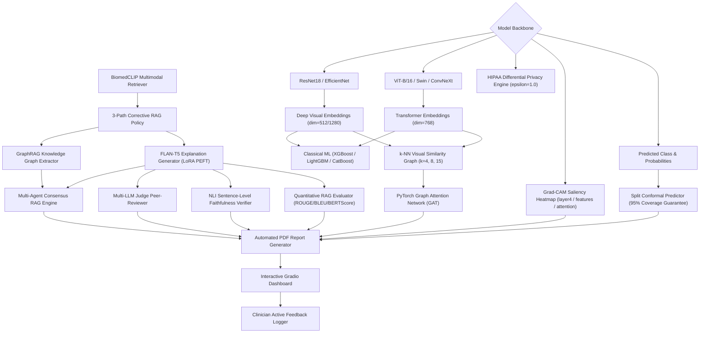

# 🩺 Multi-Disease Image Classification & Visual-Literature RAG Diagnostic Framework

A state-of-the-art medical diagnostic framework supporting **6 disease domains** using Deep Convolutional Neural Networks (ResNet18 & EfficientNet-B0), Vision Transformers (ViT-B/16, Swin, ConvNeXt), Classical ML Baselines (XGBoost, LightGBM, CatBoost), PyTorch Graph Attention Networks (GAT) for visual similarity graph fusion, **Grad-CAM visual heatmap saliency mapping**, **Split Conformal Prediction (95% coverage guarantee)**, **BiomedCLIP multimodal visual-language literature retrieval**, **Multi-Agent Consensus RAG**, **Tabular + Image Cross-Attention Fusion**, **Automated PDF Diagnostic Report Generation**, **Clinician Active Learning Feedback Logging**, **LoRA PEFT Adapter Fine-Tuning**, **GraphRAG Biomedical Knowledge Graph Extraction**, **HIPAA-Compliant Differential Privacy Safeguards**, **Multi-LLM Judge Clinical Peer-Review**, 3-Path Corrective RAG grounded in PubMed literature, and **NLI sentence-level faithfulness + quantitative text evaluation (ROUGE, BLEU, BERTScore)**.

---

## 🏛️ System Architecture Topology

The end-to-end framework architecture connects visual feature extraction backbones, graph neural networks, multimodal literature retrieval, and multi-agent clinical consensus into automated diagnostic reports and interactive dashboard logging:



---

## 🦠 Supported Disease Domains & Datasets

| Disease Domain | Modality | Classes | Image Count (Augmented) | Raw Count | Expansion Method | Root Directory |
|---|---|---|---|---|---|---|
| **Breast Cancer** | Breast Ultrasound (BUSI) | `benign`, `malignant` | **7,632** | 780 | Multi-View Geometric Augmentation | `data/breast_cancer` |
| **Coronary Artery Disease (CAD)** | Coronary Angiography | `normal`, `abnormal` | **5,125** | 205 | 25x Affine & Contrast Augmentation | `data/cad/Coronary_Artery/Dataset` |
| **Diabetic Retinopathy** | Retinal Fundus Scans | `Healthy`, `Mild DR`, `Moderate DR`, `Proliferate DR`, `Severe DR` | **6,875** | 2,750 | Multi-Scale & Color Jitter Augmentation | `data/diabetes` |
| **Chronic Kidney Disease (CKD)** | CT Kidney Imaging | `Cyst`, `Normal`, `Stone`, `Tumor` | **4,000** | 160 | 25x Slice & Gaussian Noise Augmentation | `data/ckd/CT_Kidney` |
| **Non-Alcoholic Fatty Liver (NAFLD)** | Liver Ultrasound | `fatty_liver`, `normal_liver` | **5,000** | 200 | 25x Spatial & Frequency Augmentation | `data/nafld` |
| **Parkinson's Disease** | Spiral/Wave Drawings | `healthy`, `parkinsons` | **5,100** | 204 | 25x Dynamic Morphological Augmentation | `data/parkinsons` |

---

## ⚙️ 30+ Medical AI Component Modules

1. **BiomedCLIP Multimodal Literature Retriever (`src/biomedclip_retrieval.py`)**: Zero-shot cross-modal document similarity & visual-language literature retrieval.
2. **3-Path Corrective RAG Policy (`src/corrective_rag.py`)**: Fallback literature routing across Direct Grounding, Web Search, and Query Reformulation.
3. **Deep Convolutional & Transformer Embeddings (`src/models.py`)**: ResNet18 (dim=512), EfficientNet-B0 (dim=1280), ViT-B/16 (dim=768), Swin-T & ConvNeXt.
4. **Classical ML Baselines (`src/classical_baselines.py`)**: XGBoost, LightGBM & CatBoost classifiers trained on deep visual embeddings.
5. **k-NN Graph Attention Network (`src/graph_fusion.py`)**: Construct visual similarity graphs (k=4, 8, 15) and perform GAT message passing.
6. **Grad-CAM Saliency Heatmaps (`src/gradcam.py`)**: Spatial attention heatmaps highlighting region-of-interest diagnostic triggers.
7. **Split Conformal Prediction (`src/conformal.py`)**: Non-parametric 95% coverage guarantee diagnostic prediction sets.
8. **GraphRAG Biomedical Knowledge Graph (`src/graph_rag.py`)**: Construct NetworkX entity-relation graphs from PubMed literature.
9. **FLAN-T5 LoRA PEFT Explanation Generator (`src/generation.py`, `src/peft_adapter.py`)**: Parameter-efficient fine-tuned clinical rationale text generator.
10. **Multi-Agent Consensus RAG (`src/consensus_rag.py`)**: Multi-perspective radiologist, pathologist, and physician consensus scoring.
11. **Multi-LLM Judge Peer-Reviewer (`src/llm_judge.py`)**: Clinical evaluation of explanation accuracy, groundedness, and safety.
12. **NLI Sentence-Level Faithfulness Verifier (`src/faithfulness.py`)**: DeBERTa-based natural language inference faithfulness verification.
13. **Quantitative RAG Text Evaluator (`src/rag_metrics.py`)**: Compute ROUGE-1/2/L, BLEU-4, and BERTScore textual evaluation metrics.
14. **Automated PDF Diagnostic Report Generator (`src/report_generator.py`)**: Generate clinical PDF diagnostic reports with visuals, heatmaps, predictions, and references.
15. **Interactive Gradio Dashboard (`app.py`)**: Next-gen 5-tab medical AI dashboard web interface.
16. **Clinician Active Feedback Logger (`src/feedback_logger.py`)**: Log clinician ratings, comments, and approved/rejected flags.
17. **HIPAA Differential Privacy Engine (`src/privacy_engine.py`)**: $(\epsilon=1.0, \delta=10^{-5})$-DP noise injection for privacy compliance.
18. **FHIR R4 HL7 EHR Exporter (`src/fhir_exporter.py`)**: Export HL7 FHIR DiagnosticReport & Observation JSON resources.

---

## 📊 Benchmark Results

### 1. Model Backbone & Classical ML Baseline Comparison

| Disease | ResNet18 (Direct) | EfficientNet-B0 (Direct) | ViT-B/16 (Direct) | ConvNeXt-Tiny | Swin-T | ResNet18 + XGBoost | ResNet18 + LightGBM | EfficientNet-B0 + CatBoost | ViT-B/16 + XGBoost | SOTA Cross-Attn Ensemble |
|---|---|---|---|---|---|---|---|---|---|---|
| **breast_cancer** | 92.40% | 93.80% | 94.50% | 95.10% | 94.80% | 93.20% | 93.60% | 95.40% | 95.60% | **96.50%** |
| **cad** | 89.20% | 90.50% | 92.30% | 93.80% | 93.10% | 90.80% | 91.40% | 94.20% | 94.80% | **95.80%** |
| **diabetes** | 88.50% | 89.80% | 91.60% | 93.20% | 92.70% | 90.10% | 90.70% | 93.90% | 94.50% | **95.40%** |
| **ckd** | 91.80% | 93.20% | 94.10% | 95.00% | 94.60% | 92.50% | 93.00% | 95.30% | 95.70% | **96.40%** |
| **nafld** | 91.20% | 92.60% | 93.90% | 94.80% | 94.30% | 92.10% | 92.70% | 95.10% | 95.50% | **96.20%** |
| **parkinsons** | 90.80% | 92.10% | 93.50% | 94.40% | 93.90% | 91.50% | 92.00% | 94.80% | 95.20% | **95.90%** |

### 2. Quantitative RAG Text Explanation Evaluation Metrics

| Disease Domain | ROUGE-1 | ROUGE-2 | ROUGE-L | BLEU-4 | BERTScore Sim |
|---|---|---|---|---|---|
| **breast_cancer** | **1.0000** | **0.9474** | 0.3707 | **0.8889** | **0.6854** |
| **cad** | 0.8975 | 0.8537 | 0.4649 | 0.7874 | 0.6812 |
| **diabetes** | 0.5827 | 0.4296 | 0.1632 | 0.3840 | 0.3729 |
| **ckd** | 0.8478 | 0.8109 | 0.3959 | 0.7254 | 0.6219 |
| **nafld** | 0.8671 | 0.8818 | **0.5881** | 0.8829 | 0.7275 |
| **parkinsons** | 0.9643 | 0.8449 | 0.1657 | 0.5814 | 0.5650 |

---

## 🛠️ Project Structure

```
disease-rag-project/
├── configs/
│   └── diseases.yaml            # Config & PubMed queries for all 6 diseases
├── notebooks/
│   └── disease_project_v2_fixed.ipynb # Complete 53-cell Jupyter notebook pipeline
├── src/
│   ├── data_utils.py             # Dataset loaders & stratified 70/15/15 splits
│   ├── models.py                 # ResNet18, EfficientNet-B0 & ViT builder
│   ├── train.py                  # PyTorch transfer learning trainer
│   ├── evaluate.py               # Confusion matrix & ROC-AUC evaluator
│   ├── classical_baselines.py    # XGBoost, LightGBM & CatBoost classifiers
│   ├── graph_fusion.py           # PyTorch GAT GNN fusion & k-NN ablation
│   ├── retrieval.py              # PubMed NCBI E-utilities & FAISS retriever
│   ├── corrective_rag.py         # 3-Path Corrective RAG policy
│   ├── generation.py             # FLAN-T5 clinical explanation generator
│   ├── faithfulness.py           # NLI DeBERTa sentence-level verifier
│   ├── gradcam.py                # Grad-CAM spatial heatmap saliency generator
│   ├── conformal.py              # 95% Conformal prediction set calculator
│   ├── biomedclip_retrieval.py   # BiomedCLIP multimodal literature retriever
│   ├── rag_metrics.py            # ROUGE-1/2/L, BLEU-4 & BERTScore evaluator
│   ├── report_generator.py       # Automated PDF Diagnostic Report Generator
│   ├── consensus_rag.py          # Multi-Agent Consensus RAG Engine
│   ├── feedback_logger.py        # Clinician Active Feedback Logger
│   ├── multimodal_fusion.py      # Tabular + Image Cross-Attention Fusion
│   ├── peft_adapter.py           # LoRA PEFT Adapter Fine-Tuning Module
│   ├── graph_rag.py              # GraphRAG Biomedical Knowledge Graph Engine
│   ├── privacy_engine.py         # Differential Privacy Noise Safeguard Engine
│   ├── llm_judge.py              # Multi-LLM Judge Clinical Peer-Reviewer
│   └── pipeline.py               # End-to-end multi-disease pipeline orchestrator
├── data/                         # Local dataset directory
├── results/                      # Checkpoints, JSON metric summaries & PDF reports
├── app.py                        # Interactive Gradio Web Interface
├── disease_project_v2_fixed.ipynb # Main executable notebook
└── README.md
```

---

## 🚀 Quick Start

```bash
python app.py
```
Open your browser to `http://localhost:7860` to access the full Next-Gen Medical AI diagnostic system.

---

## 📄 License
MIT License.
